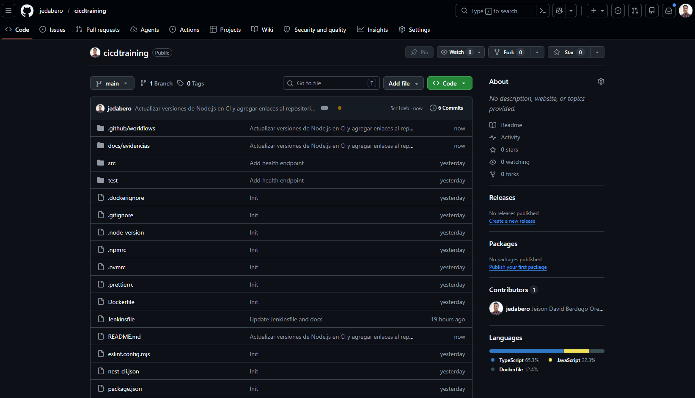
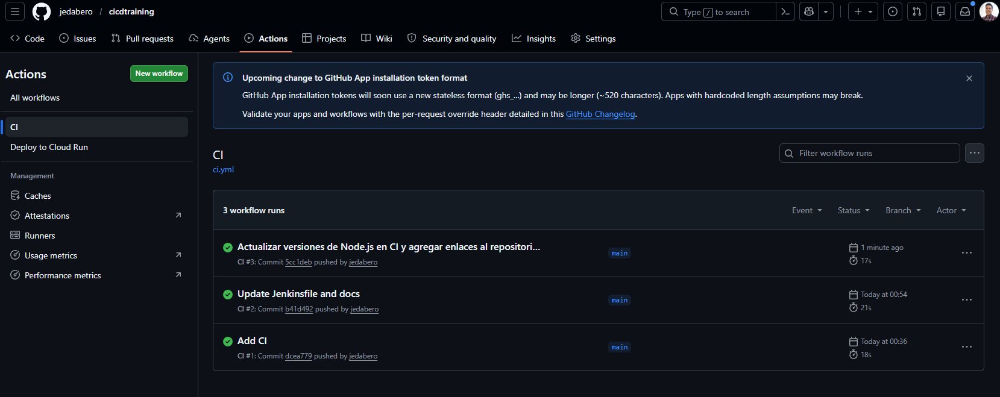
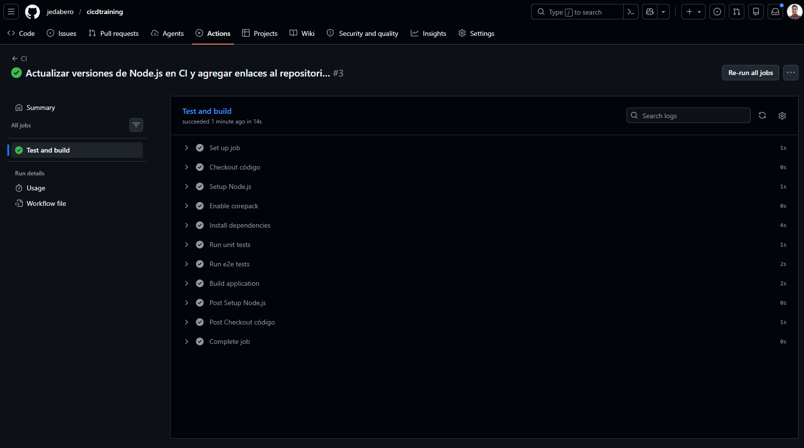
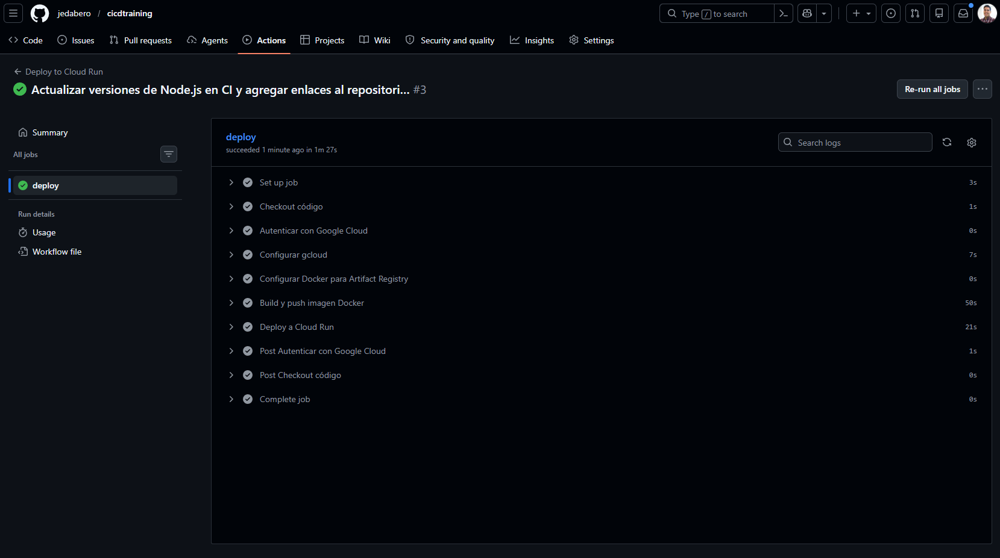
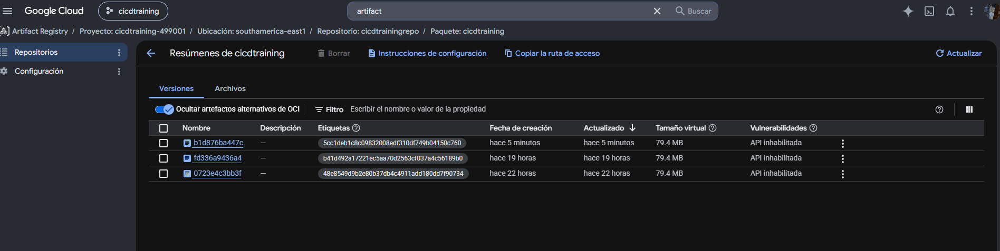
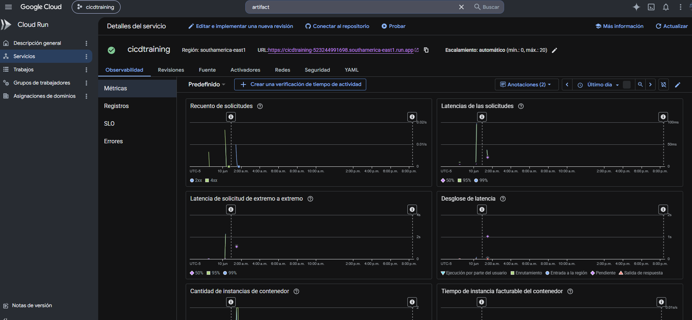
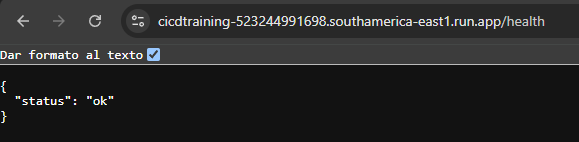
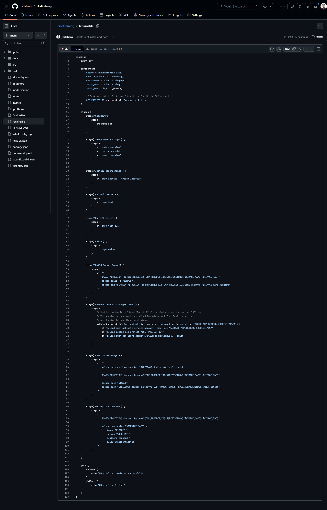

# Evidencias del laboratorio

Esta carpeta está destinada a organizar las capturas de pantalla o enlaces de evidencia de la Actividad 3.

Repositorio asociado:

- `https://github.com/jedabero/cicdtraining`

## Capturas

- Repositorio `jedabero/cicdtraining` en GitHub.
- Workflow CI en GitHub Actions ejecutado correctamente.
- Workflow CD en GitHub Actions ejecutado correctamente.
- Imagen Docker publicada en Google Artifact Registry.
- Servicio `cicdtraining` desplegado en Google Cloud Run.
- Endpoint principal funcionando: `https://cicdtraining-523244991698.southamerica-east1.run.app`.
- Endpoint de salud funcionando: `https://cicdtraining-523244991698.southamerica-east1.run.app/health`.
- Archivo `Jenkinsfile` con stages definidos.
- Pipeline de Jenkins ejecutado, solo si se decide probar Jenkins.

## Evidencias incluidas

### 1. Repositorio en GitHub

La captura muestra el repositorio `jedabero/cicdtraining` en GitHub, la rama `main` y los archivos principales del entregable, incluyendo `.github/workflows`, `docs/evidencias`, `Dockerfile`, `Jenkinsfile`, `README.md`, `src` y `test`.

### 2. Workflow CI exitoso

La captura muestra el workflow `CI` en GitHub Actions con ejecuciones exitosas sobre la rama `main`.

### 3. Detalle del workflow CI

La captura muestra el job `Test and build` ejecutado correctamente, incluyendo checkout, configuración de Node.js, activación de Corepack, instalación de dependencias, pruebas unitarias, pruebas e2e y build de la aplicación.

### 4. Workflow CD exitoso

La captura muestra el workflow `Deploy to Cloud Run` ejecutado correctamente, con pasos de autenticación en Google Cloud, configuración de Docker para Artifact Registry, build y push de imagen Docker, y despliegue en Cloud Run.

### 5. Imagen en Artifact Registry

La captura muestra el paquete `cicdtraining` publicado en Google Artifact Registry, dentro del repositorio `cicdtrainingrepo` en la región `southamerica-east1`, con versiones de imagen disponibles.

### 6. Servicio en Cloud Run

La captura muestra el servicio `cicdtraining` desplegado en Google Cloud Run, en la región `southamerica-east1`, con URL pública disponible.

### 7. Endpoint `/health`

La captura muestra el endpoint `/health` respondiendo correctamente con `{ "status": "ok" }` desde la URL pública de Cloud Run.

### 8. Jenkinsfile definido

La captura muestra el archivo `Jenkinsfile` en GitHub. Se evidencian los stages del pipeline declarativo: checkout, instalación de dependencias, pruebas, build, construcción de imagen Docker, autenticación, push de imagen y despliegue.

Nota: no se incluye captura de una ejecución real en Jenkins. Para esta actividad, la guía indica que no es indispensable que Jenkins esté funcionando completamente; el criterio principal se cubre con la correcta definición del `Jenkinsfile`.

En conjunto, las evidencias incluidas cubren el repositorio, CI con GitHub Actions, CD con GitHub Actions, publicación de imagen, despliegue en Cloud Run, validación del endpoint `/health` y definición del `Jenkinsfile`.
